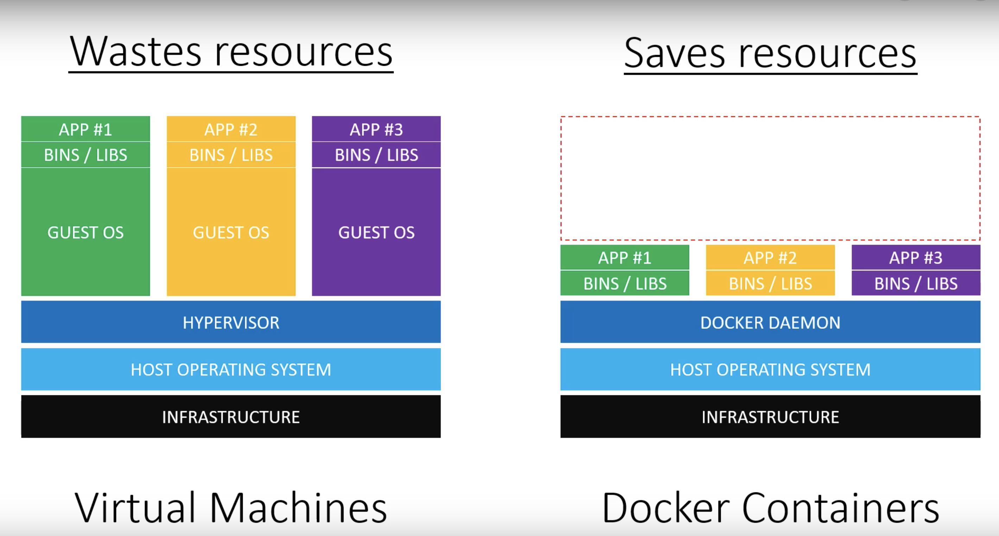

# Docker導入のすすめ

## 開発と本番の差異

アプリケーションを開発を行っていると、開発機と本番機の環境が異なっていることがよくあることだろう。

開発機はWindows、本番機はLinuxとまずOSの違いがあり、またランタイムのバージョンの違いがあり、さらにPHPがモジュール版とFPM版とで違いがあり……と少し上げてみるだけでかなりの量があることに気が付く。

実際、納品時にプログラムがエラーを起こしてはじめてこの際に気付くことすらもよくあることである。

## 従来の開発環境

これまで、こういった環境の差異を埋めるのにはVMwareやVirtualboxなどの仮想化技術がよく使われていた。
Windows上でLinux環境を起動したり、そもそも仮想化用のOSを起動してその上にLinux環境を複数用意したり、などといった感じだ。

しかしこのVM（バーチャルマシン＝仮想マシン）は弱点があった。
ホストとなるWindows等へ要求するマシンのスペックが高いのである。

VMは基本的にCPUやメモリを分割してLinuxなどに分け与えることとなるため、そもそものスペックが高めでなければすぐにリソース不足に陥ってしまい、結果的にそれが処理落ち、障害等に繋がってしまう。

開発に使用する環境がしょっちゅう処理落ちしていてはとてもやっていられないのである。

## Dockerのメリット

出典：[VMとDockerについて比較してみた #Docker - Qiita](https://qiita.com/moonorange/items/ee67491fde07fa55fae4)

今回紹介するDockerは、これまでのVMの弱点を補うように登場した「コンテナ開発」の技術を扱うものである。

コンテナはアプリケーションを実行するための領域を複数に分割して利用するものであり、概念としてはこれまでのVMとは大きく異なっている。

大きな特徴としては、ApacheやPHP、PostgreSQLなどの小さなサービス単位でコンテナを分割して起動し、複数のコンテナを組み合わせて環境を作成するというもので、これによって非常に軽量な動作が実現されている。従来のVMに比べるとその差は歴然である。

コンテナはOSではないため、CPUやメモリの消費が少なくストレージの使用も僅かになっており、ホストマシンと領域を共有しているためファイルの共有も容易である。

また、Docker等で作成した環境はコピーがしやすくなっており、どのマシンに入れても同じ環境を作ることができるため環境の差異を極めて小さくすることができる。これをよく「可搬性が高い」と言われている。

## まとめ

Dockerを使用することで、改行コードやパスの記法、Shell・Batchの記法など、エンジニアを悩ませる煩わしいOSの差異を意識することなく開発を進めることができる。
例えば、WindowsでDC-MAXsを動作させようとしたとき、直書きされているパスの書き換えからすることになるが、この作業が不要となる。

快適な開発を進めていくために、この機会にDockerを導入してみることを推奨したい。

## 注意事項

WindowsのマシンでDockerを動作させる場合は、基本的にWSL2(Windows Subsystem for Linux)上で動作することになる。
WSLは名前の通りLinuxのプログラムをWindows10/11およびWindowsServer上で実行するための仕組みである。

Dockerはあくまでコンテナ仮想化ソフトウェアであり、WSLと同一ではない。
WSLはWindowsのコンポーネントであり、言うなればLinuxエミュレーターであるが、Dockerはマシン上に仮想の環境を作り開発を便利にするエンジンである。

WSLはほぼ別のOSをインストールしているのに感覚が近いが、Dockerは厳密にはOSではなくコンテナ環境である。OSに似た挙動を取ることも多いが、WSLやVMなどよりもホストマシンとの共有部分が多く軽量である。

今回のDockerはWSL上で動くため、最終的な形としてはWindowsの上にWSL、その上にDockerエンジン、さらにその上にコンテナということになる。

そのためDockerコンテナを仮想OSとして使うのは本来のDockerの使い方ではないので注意されたい。
